# Architecture

Secure GKD now contains two independently deployable Java 17 Spring Boot services.
The existing allocation service remains the authoritative synchronous HTTP service.
The allocation-audit service is a Kafka-driven background service with its own
PostgreSQL database and no public HTTP API. This document describes the repository's
implemented boundaries; it is not a claim about an always-running deployment.

## System view

```mermaid
flowchart LR
    Client[HTTP client]

    subgraph Allocation[Allocation service]
        Security[Spring Security filter chain]
        MVC[Spring MVC controllers and DTOs]
        Services[Application services and transactions]
        Outbox[Allocation outbox publisher]
        Security --> MVC --> Services
    end

    AllocationDatabase[(Allocation PostgreSQL 16)]
    Kafka[(secure-gkd.allocation-created)]

    subgraph Audit[Allocation-audit service]
        Consumer[Record-oriented Kafka listener]
        AuditService[Audit persistence transaction]
        Consumer --> AuditService
    end

    AuditDatabase[(Audit PostgreSQL 16)]

    Client -->|JSON over HTTP| Security
    Services -->|authoritative transaction| AllocationDatabase
    AllocationDatabase -->|committed outbox intents| Outbox
    Outbox -->|version 1 JSON keyed by event UUID| Kafka
    Kafka --> Consumer
    AuditService -->|one local transaction per accepted record| AuditDatabase
```

The principal boundaries and responsibilities are:

- The embedded HTTP server accepts synchronous requests. Spring Security applies the
  configured authentication and authorization policy before Spring MVC binds and
  validates request DTOs.
- Controllers remain thin: they translate HTTP requests and responses and delegate
  application behavior to services. API responses use DTOs rather than exposing JPA
  entities.
- The allocation service owns the synchronous workflows, API, allocation transaction,
  and outbox publication. Kafka or audit availability does not determine allocation
  success.
- The audit service consumes the published JSON contract rather than depending on
  allocation-service entities, DTOs, repositories, services, or tables. It validates
  schema version 1 and the Kafka-key/payload event identity before persistence.
- Each service has a separate Spring Data JPA/Hibernate persistence layer, HikariCP
  datasource, Flyway history, and PostgreSQL database. Hibernate uses
  `ddl-auto: validate`; neither service accesses the other's database.

## Persistence model and ownership

The allocation service owns application behavior for the following PostgreSQL-backed
records:

| Record | Responsibility and invariant |
| --- | --- |
| Games | The Game service creates and reads Games. PostgreSQL requires each Game code to be unique. |
| GameKeys | Each GameKey belongs to one Game. The allocation workflow selects the first available key by ID; PostgreSQL requires key codes to be unique. There is currently no public GameKey-provisioning endpoint. |
| Allocations | Each Allocation references exactly one GameKey and records its allocation time. A unique database constraint permits at most one Allocation per GameKey. |
| IdempotencyRecords | Each record maps one exact idempotency key to one Allocation. Separate unique constraints enforce one record per key and one record per Allocation. |
| Allocation outbox intents | Each row stores one serialized version-1 `AllocationCreated` intent for one Allocation. Its event UUID is the primary key, its Allocation reference is unique, and `published_at` remains null until Kafka acknowledges publication. |
| Authentication identities | Credential authentication reads a unique username, encoded password hash, and required role from the database. Identity provisioning and account management are external responsibilities because this service has no identity-management API. |
| Roles | Each authentication identity has exactly one supported role, `USER` or `ADMIN`. The Java enum and PostgreSQL check constraint define the same allowed values; roles are not a separate persistence resource. |

Foreign keys preserve the GameKey-to-Game, Allocation-to-GameKey,
IdempotencyRecord-to-Allocation, and allocation-outbox-to-Allocation relationships.
The audit service separately owns `allocation_audit_record`. Its Allocation and Game
IDs are plain source-system values, not cross-database relationships. The audit table
retains a service-owned record UUID, source event UUID, schema version, event and
allocation timestamps, source Allocation and Game IDs, non-secret Game code,
request-correlation ID, and its own persistence timestamp. PostgreSQL uniqueness on
the source event UUID provides the durable processed-event record; no separate
processed-event table is used. The complete schema rules are in
[Database migrations](DATABASE_MIGRATIONS.md).

## Allocation request and transaction flow

`POST /api/games/{gameCode}/allocations` executes synchronously on the request thread:

1. Spring Security requires a valid Bearer token with `USER` or `ADMIN` authority.
   Spring MVC binds and validates the request, and the controller delegates to
   `AllocationService.allocate`.
2. Calling that Spring-managed `@Transactional` method opens one transaction around
   the idempotency lookup, Game and GameKey queries, writes, and response construction.
3. An existing exact idempotency key returns the response from its original
   Allocation. The service does not select or consume another key. The lookup is by
   idempotency key alone, so replay does not cross-check the path's `gameCode`; the
   response fields come from the original Allocation. The controller returns `201`
   for both a new result and a replay.
4. For a new key, the service loads the Game and queries for the first GameKey, by ID,
   that has no Allocation. This availability query does not reserve or lock the row.
5. `AllocationRepository.saveAndFlush` sends the Allocation insert to PostgreSQL
   while the transaction is still active. This lets the service translate an
   immediate uniqueness failure, but the flush is **not** an independent commit.
6. The service saves the IdempotencyRecord, creates one `AllocationCreated` using the
   persisted Allocation and Game identities plus the request's established server
   correlation ID, serializes that contract to JSON, and saves its outbox intent.
7. The service builds the response and returns. Spring commits only after the
   transactional method completes successfully. An unchecked serialization or
   persistence failure leaving the method rolls the transaction back.

PostgreSQL-backed rollback evidence forced the idempotency save to fail after the
Allocation had been flushed. The resulting database state retained neither the
Allocation nor the IdempotencyRecord, and the original GameKey remained available.
This verifies the atomic result for that controlled failure; it does not mean a flush
commits separately. Separate PostgreSQL-backed evidence forced outbox persistence to
fail and retained none of the new Allocation, IdempotencyRecord, or outbox intent.

Availability selection can race. A controlled two-transaction test made both callers
select the same single key before either inserted it. One transaction completed; the
other reached PostgreSQL's unique constraint on `allocations.game_key_id`, was
translated to the service's unavailable-key failure, and rolled back without an
idempotency record. The application currently adds no selection lock, reservation,
retry, or isolation override: candidate selection narrows the work, while the
database uniqueness constraint is the final duplicate-allocation protection. See
[Allocation runtime and debugging](ALLOCATION_RUNTIME_DEBUGGING.md) for the full flow
and [allocation concurrency evidence](ALLOCATION_CONCURRENCY.md) for the controlled
observation and its limits.

## Allocation event contract, outbox persistence, and publication

The allocation service now owns a version-1 `AllocationCreated` JSON contract. It
defines event and allocation identities, event-intent and authoritative allocation
timestamps, Game identity and non-secret code, and server-generated request
correlation without exposing the allocated GameKey. The contract is separate from
HTTP response DTOs, JPA entities, Kafka APIs, and the outbox persistence type.

For a new Allocation, `AllocationService.allocate` persists the Allocation,
IdempotencyRecord, and one serialized event intent atomically. Idempotent replay
returns the original Allocation without creating another intent. Outside that
synchronous transaction, an optional scheduled publisher selects a bounded batch of
unpublished rows in `occurred_at`, then `event_id`, order. It sends each row's exact
stored payload sequentially to `secure-gkd.allocation-created`, keyed by the persisted
event UUID, and waits for bounded Kafka acknowledgement before conditionally recording
`published_at` in a separate transaction. The batch stops on the first failure so
later selected rows remain pending behind it.

Kafka availability is not consulted by the allocation transaction. A send failure or
timeout leaves the durable intent pending for a later polling cycle and restart
recovery. Kafka acknowledgement followed by a process or database-update failure can
cause the pending event to be sent again. Publication is therefore at-least-once.

The independent audit listener uses the stable `secure-gkd-allocation-audit` group,
`earliest` initial offsets, disabled auto-commit, and record acknowledgement. A valid
record is deserialized and persisted in one audit-owned transaction before listener
processing returns. The insert targets the unique source event UUID and atomically
creates one row or reports an already-recorded identity as an intentional successful
no-op. The original service-owned record UUID and persistence timestamp remain
unchanged on duplicate delivery. PostgreSQL commit and Kafka offset recording are
not one atomic distributed transaction, so failure between them can still redeliver
the event; audit-owned uniqueness prevents that redelivery from creating another
audit effect. This is an idempotent consumer effect, not exactly-once end-to-end
delivery.

Malformed JSON, invalid Kafka keys, unsupported versions, key/payload identity
mismatches, and other event-contract validation failures are non-retryable. They are
published immediately to `secure-gkd.allocation-created.dlt`. Persistence and other
retryable infrastructure failures receive no more than two retries after the initial
attempt, with a fixed one-second delay, before dead-letter recovery. Dead-letter
records retain the original key/value and bounded broker-visible origin, failure-type,
and failure-reason headers. Successful publication recovers the source record so later
records can progress; failed dead-letter publication remains a failed recovery and
does not advance silently. Intentionally ignored duplicates complete successfully.
Persisted, duplicate, retry, exhaustion, poison, and recovery outcomes use distinct
bounded non-secret logs. The exact contract and limitations are in the
[AllocationCreated event contract](ALLOCATION_CREATED_EVENT.md).

## Authentication and authorization

`POST /api/auth/token` is public. It submits credentials to Spring Security's
database-backed authentication path, which loads the persisted identity and verifies
the submitted password against its encoded hash. A successful request receives a
short-lived HS256-signed JWT Bearer token; the configured lifetime defaults to 15
minutes. The token carries the username and the identity's `USER` or `ADMIN` role.

Protected requests are stateless: Spring Security validates the signed Bearer token
on each request and does not create an HTTP authentication session. Authorization is
explicit: Game creation requires `ADMIN`; Game retrieval and allocation allow `USER`
or `ADMIN`; health, token issuance, and the documented OpenAPI routes are public. All
unclassified routes are denied by default. [Security](SECURITY.md) is authoritative
for token configuration, endpoint rules, credential provisioning, hardening
boundaries, and current limitations.

## Deployment architecture

The repository defines two deployable images: the root `Dockerfile` for the allocation
service and `audit-service/Dockerfile` for the background consumer. Both use Java 17,
package only their own Spring Boot application, and run as distinct non-root users.
Compose and CI use separate PostgreSQL 16 databases for the two service-owned schemas.

Production-oriented execution selects the `prod` profile and receives the datasource
URL, datasource username and password, JWT signing key, and any token-lifetime or port
override from external configuration. At startup Flyway validates and applies tracked
migrations, then Hibernate validates the migrated schema before the HTTP server is
ready. `GET /api/health` is the current public HTTP/application health endpoint. Its
controller returns application status without independently querying PostgreSQL, so
it is not a database-readiness check.

The audit service receives its own datasource settings plus Kafka bootstrap, source
topic, dead-letter topic, group, retry-count, and backoff configuration. Normal Spring
shutdown closes its listener container, consumer, producer, datasource, and JPA
resources. The allocation service has no dependency on the audit container or audit
database and remains startable and healthy while the audit service is stopped.

This repository-defined contract is provider-neutral and is detailed in
[Deployment runtime](DEPLOYMENT_RUNTIME.md). The separate
[Render deployment verification](DEPLOYMENT_VERIFICATION.md) records bounded
historical evidence from one temporary Render Web Service and PostgreSQL database. It
does not define the architecture or imply that a continuously running Render
deployment exists: those temporary resources were removed after verification.

## Detailed references

- [Allocation runtime and debugging](ALLOCATION_RUNTIME_DEBUGGING.md)
- [Allocation concurrency evidence](ALLOCATION_CONCURRENCY.md)
- [AllocationCreated event contract](ALLOCATION_CREATED_EVENT.md)
- [Security and hardening overview](SECURITY.md)
- [Database migrations](DATABASE_MIGRATIONS.md)
- [Configuration profiles](CONFIGURATION_PROFILES.md)
- [Deployment runtime](DEPLOYMENT_RUNTIME.md)
- [Render deployment verification](DEPLOYMENT_VERIFICATION.md)
- [Application startup](APPLICATION_STARTUP.md)
