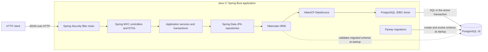

# Architecture

Secure GKD is currently one synchronous Java 17 Spring Boot service backed by
PostgreSQL. This document is the reviewer-facing entry point to the architecture that
exists in this repository; it is not a target architecture or a claim about an
always-running deployment.

## System view

The principal boundaries and responsibilities are:

- The embedded HTTP server accepts synchronous requests. Spring Security applies the
  configured authentication and authorization policy before Spring MVC binds and
  validates request DTOs.
- Controllers remain thin: they translate HTTP requests and responses and delegate
  application behavior to services. API responses use DTOs rather than exposing JPA
  entities.
- Services own application workflows and transaction boundaries. Spring Data
  repositories own persistence access, and Hibernate maps the entities and manages
  the transaction-bound persistence context. Open-in-view is disabled.
- Hibernate obtains JDBC access through the Spring-managed HikariCP datasource;
  HikariCP pools PostgreSQL JDBC connections. Application services and repositories
  do not open JDBC connections directly for normal work.
- PostgreSQL stores durable state and enforces relational constraints that are part
  of the correctness model. Flyway owns normal schema creation and evolution;
  Hibernate uses `ddl-auto: validate` after migration and does not create or update
  the normal schema.

## Persistence model and ownership

The service owns application behavior for the following PostgreSQL-backed records:

| Record | Responsibility and invariant |
| --- | --- |
| Games | The Game service creates and reads Games. PostgreSQL requires each Game code to be unique. |
| GameKeys | Each GameKey belongs to one Game. The allocation workflow selects the first available key by ID; PostgreSQL requires key codes to be unique. There is currently no public GameKey-provisioning endpoint. |
| Allocations | Each Allocation references exactly one GameKey and records its allocation time. A unique database constraint permits at most one Allocation per GameKey. |
| IdempotencyRecords | Each record maps one exact idempotency key to one Allocation. Separate unique constraints enforce one record per key and one record per Allocation. |
| Authentication identities | Credential authentication reads a unique username, encoded password hash, and required role from the database. Identity provisioning and account management are external responsibilities because this service has no identity-management API. |
| Roles | Each authentication identity has exactly one supported role, `USER` or `ADMIN`. The Java enum and PostgreSQL check constraint define the same allowed values; roles are not a separate persistence resource. |

Foreign keys preserve the GameKey-to-Game, Allocation-to-GameKey, and
IdempotencyRecord-to-Allocation relationships. The complete schema and adoption rules
are in [Database migrations](DATABASE_MIGRATIONS.md).

## Allocation request and transaction flow

`POST /api/games/{gameCode}/allocations` executes synchronously on the request thread:

1. Spring Security requires a valid Bearer token with `USER` or `ADMIN` authority.
   Spring MVC binds and validates the request, and the controller delegates to
   `AllocationService.allocate`.
2. Calling that Spring-managed `@Transactional` method opens one transaction around
   the idempotency lookup, Game and GameKey queries, writes, and response construction.
3. An existing exact idempotency key returns the response from its original
   Allocation. The service does not select or consume another key. The lookup is by
   idempotency key alone, so replay does not cross-check the path's `gameCode`; the
   response fields come from the original Allocation. The controller returns `201`
   for both a new result and a replay.
4. For a new key, the service loads the Game and queries for the first GameKey, by ID,
   that has no Allocation. This availability query does not reserve or lock the row.
5. `AllocationRepository.saveAndFlush` sends the Allocation insert to PostgreSQL
   while the transaction is still active. This lets the service translate an
   immediate uniqueness failure, but the flush is **not** an independent commit.
6. The service saves the IdempotencyRecord, builds the response, and returns. Spring
   commits only after the transactional method completes successfully. An unchecked
   failure leaving the method rolls the transaction back.

PostgreSQL-backed rollback evidence forced the idempotency save to fail after the
Allocation had been flushed. The resulting database state retained neither the
Allocation nor the IdempotencyRecord, and the original GameKey remained available.
This verifies the atomic result for that controlled failure; it does not mean a flush
commits separately.

Availability selection can race. A controlled two-transaction test made both callers
select the same single key before either inserted it. One transaction completed; the
other reached PostgreSQL's unique constraint on `allocations.game_key_id`, was
translated to the service's unavailable-key failure, and rolled back without an
idempotency record. The application currently adds no selection lock, reservation,
retry, or isolation override: candidate selection narrows the work, while the
database uniqueness constraint is the final duplicate-allocation protection. See
[Allocation runtime and debugging](ALLOCATION_RUNTIME_DEBUGGING.md) for the full flow
and [allocation concurrency evidence](ALLOCATION_CONCURRENCY.md) for the controlled
observation and its limits.

## Allocation event contract

The allocation service now owns a version-1 `AllocationCreated` JSON contract. It
defines event and allocation identities, event-intent and authoritative allocation
timestamps, Game identity and non-secret code, and server-generated request
correlation without exposing the allocated GameKey. The contract is separate from
HTTP response DTOs, JPA entities, Kafka APIs, and future outbox persistence types.

This is a contract boundary only. `AllocationService.allocate` does not create,
persist, or publish the event, and idempotent replay remains only a synchronous return
of the original Allocation. The exact fields, semantics, compatibility rules,
ownership, secret exclusions, and future-work boundary are in the
[AllocationCreated event contract](ALLOCATION_CREATED_EVENT.md).

## Authentication and authorization

`POST /api/auth/token` is public. It submits credentials to Spring Security's
database-backed authentication path, which loads the persisted identity and verifies
the submitted password against its encoded hash. A successful request receives a
short-lived HS256-signed JWT Bearer token; the configured lifetime defaults to 15
minutes. The token carries the username and the identity's `USER` or `ADMIN` role.

Protected requests are stateless: Spring Security validates the signed Bearer token
on each request and does not create an HTTP authentication session. Authorization is
explicit: Game creation requires `ADMIN`; Game retrieval and allocation allow `USER`
or `ADMIN`; health, token issuance, and the documented OpenAPI routes are public. All
unclassified routes are denied by default. [Security](SECURITY.md) is authoritative
for token configuration, endpoint rules, credential provisioning, hardening
boundaries, and current limitations.

## Deployment architecture

The repository defines one deployable application service through its multi-stage
`Dockerfile`. Both build and runtime stages use Java 17, and the final image runs only
the packaged Spring Boot JAR as a non-root user. PostgreSQL 16 is the repository's
current Compose, CI, and controlled deployment-verification baseline; database
provisioning remains outside the application image.

Production-oriented execution selects the `prod` profile and receives the datasource
URL, datasource username and password, JWT signing key, and any token-lifetime or port
override from external configuration. At startup Flyway validates and applies tracked
migrations, then Hibernate validates the migrated schema before the HTTP server is
ready. `GET /api/health` is the current public HTTP/application health endpoint. Its
controller returns application status without independently querying PostgreSQL, so
it is not a database-readiness check.

This repository-defined contract is provider-neutral and is detailed in
[Deployment runtime](DEPLOYMENT_RUNTIME.md). The separate
[Render deployment verification](DEPLOYMENT_VERIFICATION.md) records bounded
historical evidence from one temporary Render Web Service and PostgreSQL database. It
does not define the architecture or imply that a continuously running Render
deployment exists: those temporary resources were removed after verification.

## Detailed references

- [Allocation runtime and debugging](ALLOCATION_RUNTIME_DEBUGGING.md)
- [Allocation concurrency evidence](ALLOCATION_CONCURRENCY.md)
- [AllocationCreated event contract](ALLOCATION_CREATED_EVENT.md)
- [Security and hardening overview](SECURITY.md)
- [Database migrations](DATABASE_MIGRATIONS.md)
- [Configuration profiles](CONFIGURATION_PROFILES.md)
- [Deployment runtime](DEPLOYMENT_RUNTIME.md)
- [Render deployment verification](DEPLOYMENT_VERIFICATION.md)
- [Application startup](APPLICATION_STARTUP.md)
